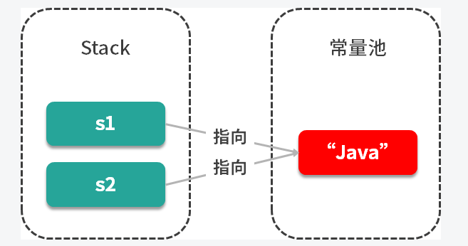
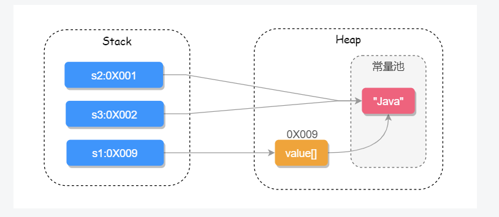
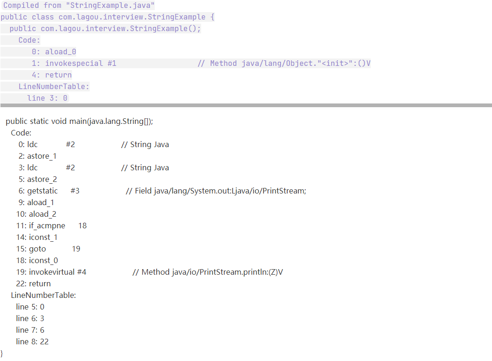

### 为什么 String 类型要用 final 修饰？
从 String 类的源码我们可以看出 String 是被 final 修饰的不可继承类，源码如下：

    public final class String 
        implements java.io.Serializable, Comparable<String>, CharSequence { //...... }

那这样设计有什么好处呢？
Java 语言之父 James Gosling 的回答是，他会更倾向于使用 final，因为它能够缓存结果，当你在传参时不需要考虑谁会修改它的值；如果是可变类的话，则有可能需要重新拷贝出来一个新值进行传参，这样在性能上就会有一定的损失。
James Gosling 还说迫使 String 类设计成不可变的另一个原因是安全，当你在调用其他方法时，比如调用一些系统级操作指令之前，可能会有一系列校验，如果是可变类的话，可能在你校验过后，它的内部的值又被改变了，这样有可能会引起严重的系统崩溃问题，这是迫使 String 类设计成不可变类的一个重要原因。
总结来说，使用 final 修饰的第一个好处是安全；第二个好处是高效，以 JVM 中的字符串常量池来举例，如下两个变量：
String s1 = "java";
String s2 = "java";

只有字符串是不可变时，我们才能实现字符串常量池，字符串常量池可以为我们缓存字符串，提高程序的运行效率，如下图所示：
    
试想一下如果 String 是可变的，那当 s1 的值修改之后，s2 的值也跟着改变了，这样就和我们预期的结果不相符了，因此也就没有办法实现字符串常量池的功能了。
###== 和 equals 的区别是什么？
== 对于基本数据类型来说，是用于比较 “值”是否相等的；而对于引用类型来说，是用于比较引用地址是否相同的。
查看源码我们可以知道 Object 中也有 equals()  方法，源码如下：

    public boolean equals(Object obj) {
        return (this == obj);
    }

可以看出，Object 中的 equals() 方法其实就是 ==，而 String 重写了 equals() 方法把它修改成比较两个字符串的值是否相等。
源码如下：

    public boolean equals(Object anObject) {
        // 对象引用相同直接返回 true
        if (this == anObject) {
            return true;
        }
        // 判断需要对比的值是否为 String 类型，如果不是则直接返回 false
        if (anObject instanceof String) {
            String anotherString = (String)anObject;
            int n = value.length;
            if (n == anotherString.value.length) {
                // 把两个字符串都转换为 char 数组对比
                char v1[] = value;
                char v2[] = anotherString.value;
                int i = 0;
                // 循环比对两个字符串的每一个字符
                while (n-- != 0) {
                    // 如果其中有一个字符不相等就 true false，否则继续对比
                    if (v1[i] != v2[i])
                        return false;
                    i++;
                }
                return true;
            }
        }
        return false;
    }
###String 和 StringBuilder、StringBuffer 有什么区别？
因为 String 类型是不可变的，所以在字符串拼接的时候如果使用 String 的话性能会很低，因此我们就需要使用另一个数据类型 StringBuffer，它提供了 append 和 insert 方法可用于字符串的拼接，它使用 synchronized 来保证线程安全，如下源码所示：

    @Override
    public synchronized StringBuffer append(Object obj) {
        toStringCache = null;
        super.append(String.valueOf(obj));
        return this;
    }
    @Override
    public synchronized StringBuffer append(String str) {
        toStringCache = null;
        super.append(str);
        return this;
    }
因为它使用了 synchronized 来保证线程安全，所以性能不是很高，于是在 JDK 1.5 就有了 StringBuilder，它同样提供了 append 和 insert 的拼接方法，但它没有使用 synchronized 来修饰，因此在性能上要优于 StringBuffer，所以在非并发操作的环境下可使用 StringBuilder 来进行字符串拼接。
###String 的 intern() 方法有什么含义？
###String 类型在 JVM（Java 虚拟机）中是如何存储的？编译器对 String 做了哪些优化？
String 常见的创建方式有两种，new String() 的方式和直接赋值的方式，直接赋值的方式会先去字符串常量池中查找是否已经有此值，如果有则把引用地址直接指向此值，否则会先在常量池中创建，然后再把引用指向此值；而 new String() 的方式一定会先在堆上创建一个字符串对象，然后再去常量池中查询此字符串的值是否已经存在，如果不存在会先在常量池中创建此字符串，然后把引用的值指向此字符串，如下代码所示:
        String s1 = new String("Java");// 堆中
        String s2 = s1.intern();//s2指向字符串常量池
        String s3 = "Java";//s3指向字符串常量池
        System.out.println(s1 == s2);//false
        System.out.println(s2 == s3);//true

它们在 JVM 存储的位置，如下图所示：
  
JDK 1.7 之后把永生代换成的元空间，把字符串常量池从方法区移到了 Java 堆上。
除此之外编译器还会对 String 字符串做一些优化，例如以下代码：

        String s1 = "Ja" + "va";
        String s2 = "Java";
        System.out.println(s1 == s2);// true

虽然 s1 拼接了多个字符串，但对比的结果却是 true，我们使用反编译工具，看到的结果如下：
    
从编译代码 #2 可以看出，代码 "Ja"+"va" 被直接编译成了 "Java" ，因此 s1==s2 的结果才是 true，这就是编译器对字符串优化的结果。