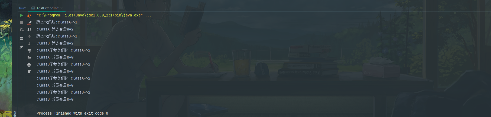

* TestExtendInit 初始化执行结果 
* 类和实例初始化过程 
---

---
        public class ClassB {
            private int a = 1234;
            static long C = 1111;
        
            public long test(long num) {
                long ret = this.a + C + num;
                return ret;
            }
        }

## 字符串常量池
   